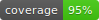

[](https://hung61601.github.io/motaDRL/tests/coverage/)  

# Mota DRL

Mota DRL 是「使用深度強化學習的魔塔 AI」(Mota AI using Deep Reinforcement Learning) 的簡寫。

本專案實現了使用 Graph Isomorphism Network 結合 Proximal Policy Optimization 來學習遊戲策略。

- 作者：Hung1

## 相依套件 Dependencies
- Python 版本為 3.11.5
- 安裝相依套件可在根目錄下使用指令：
```bash
pip install -r requirements.txt
```

## 操作介紹 Instruction
待寫...

## 單元測試 Unit Test
- 本專案使用 pytest 作為測試框架，並使用 coverage.py 收集測試覆蓋率。
- 下列指令將運行所有測試，並生成覆蓋率數據。
```bash
coverage run --omit="*test.py" -m pytest
```
- 下列指令將覆蓋率數據轉換成 html 的報表。  
您可以開啟 `./tests/coverage/index.html` 來檢視程式碼覆蓋狀況。  
```bash
coverage html --skip-empty -d .\tests\coverage
```
- 下列指令將生成覆蓋率徽章（badge）。  
```bash
coverage-badge -o coverage.svg -f
```
- 您若是在 Windows 作業系統下運行，可以參考 `coverage.ps1` 檔案的指令。
- 使用 PyCharm 運行測試時，請至工具列 File -> Settings -> Tools -> Python Integrated Tools ->Testing -> Default test runner，將設定切換成 pytest。
- 測試覆蓋率報表請 [點擊此連結](https://hung61601.github.io/motaDRL/tests/coverage/)。

## 錯誤報告 Bug Report
運行本專案時遇到任何問題，可以透過以下方式聯絡作者：
- Email: hung61601@gmail.com
